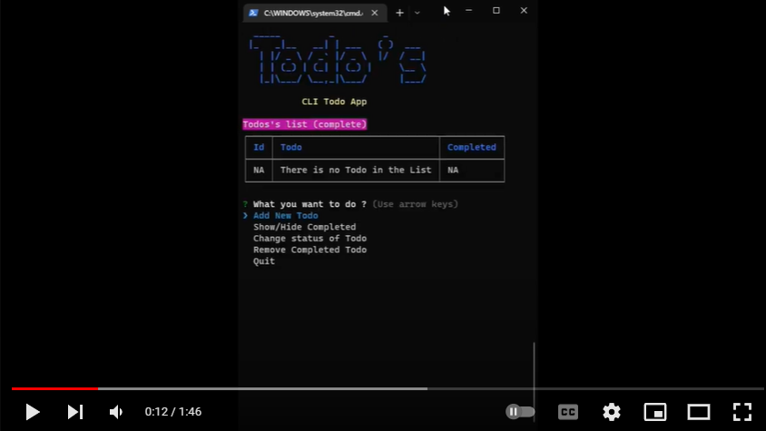

# Command Line Todo List (TS)

A CLI based todo list using typescript and published as an executable npm package, complete problem statement is available [here](https://github.com/panaverse/typescript-node-projects/tree/main/project03_todo_list).

## NPM Package

### Usage

This project is published as an [npm package](https://www.npmjs.com/package/wmd-ts-todo-list). To use follow these steps.

- Install as an npm package

  ```cmd
  npm i wmd-ts-todo-list
  ```

- Run the app after installation

  ```cmd
  wmd-ts-todo-list
  ```

- Use the app as an npx package

  ```cmd
  npx wmd-ts-todo-list
  ```

### Instructions

- List of operations available
  - Add new todo
  - Display todos table
  - Change status of a todo
  - Remove completed todos
  - Quit App

## Demo

[](https://youtu.be/2UL1xglz1t4 'CLI Todo List')

## Steps to code CLI Todo List

All the details to code this app is given [here](https://github.com/hassan-ak/wmd-ts-todo-list/tree/main/stepsToCode/Readme.md).
